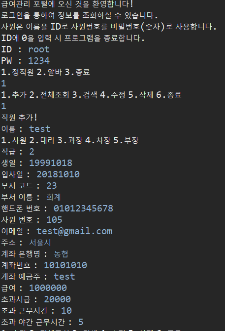
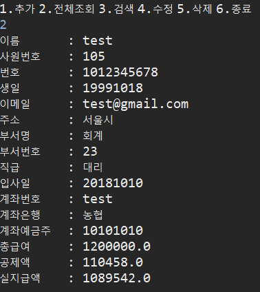
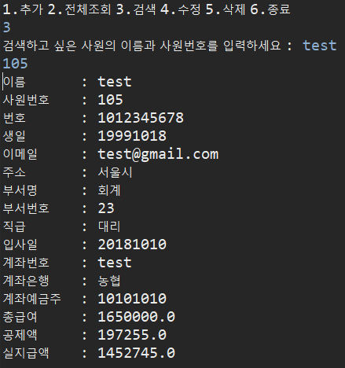
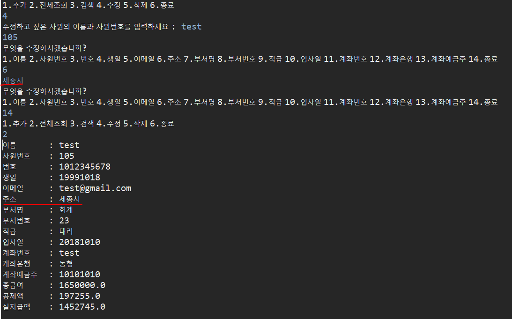
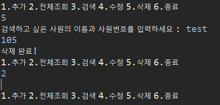
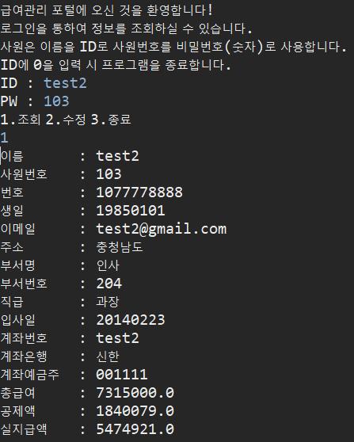
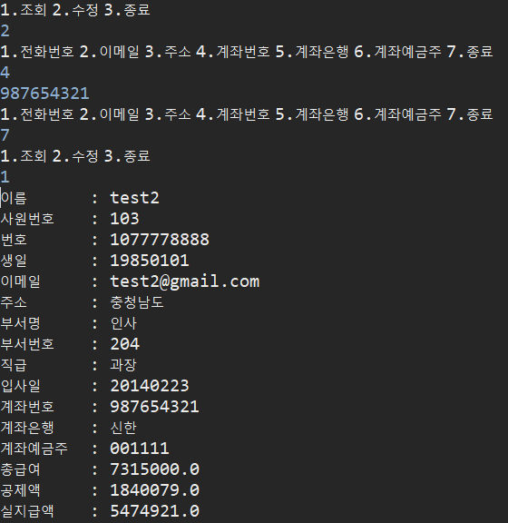

# 사원 급여관리 프로그램

## 개발환경
### 언어 : JAVA (jdk 8)
### IDE : Eclipse
### OS : Windows 10

## 클래스 다이어그램

## 프로그램 소개
* 실제 회사에서 사원에게 급여를 줄 때 해당 프로그램을 이용하여 사원의 정보를 관리할 수 있도록 구성
* **CRUD**를 적용한 정보 관리
* 세금적용 구현
* 관리자 / 사용자를 구분하여 구현
* 관리자
  * 사용자 추가
  * 사용자 조회
  * 사용자 수정
  * 사용자 삭제
* 사용자
  * 자신의 정보 조회
  * 개인정보 수정

## 실행화면

### 관리자 - 로그인 및 사용자 등록

### 관리자 - 사용자 조회

### 관리자 - 사용자 검색

### 관리자 - 사용자 수정

### 관리자 - 사용자 삭제

### 사용자 - 자신 정보 조회

### 사용자 - 자신 정보 수정

